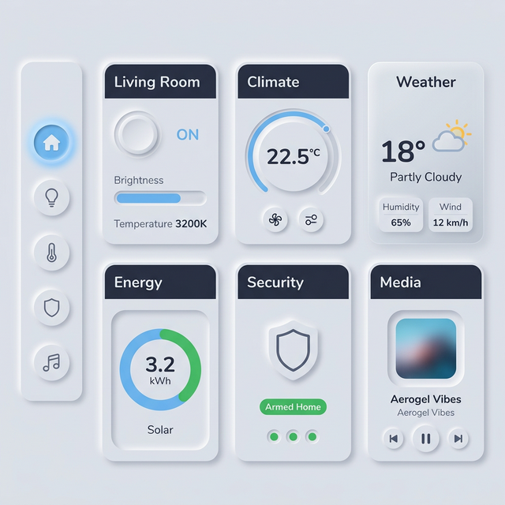

# 🫧 Aerogel — Premium Neumorphic Theme for Home Assistant

> Inspired by [Smartphone Car Control UI](https://www.figma.com/community/file/1076934576179162030) by Shivanshu Mathur

[](https://www.home-assistant.io/)
[](https://hacs.xyz/)
[](LICENSE)

> A soft-UI neumorphic theme with **400+ CSS variables**, built-in **hover/press/glow animations**, glassmorphism effects, gradient accents, and 24px rounded cards. Install it — and your entire Home Assistant transforms.

<p align="center">
  
</p>

---

## ✨ Features

- **400+ CSS variables** — every HA element covered (light & dark modes)
- **Built-in animations** — hover lift, press effect, pulse glow, alert, success, shimmer, breathe, float (via card-mod)
- **Glassmorphism** — frosted-glass cards with blur, border, and shadow variables
- **Gradient accents** — sky→mint, warm, cool, and surface gradients
- **Neumorphic sidebar** — convex/concave items with accent glow on selection
- **Premium dialogs** — frosted glass backdrop with gradient header bars
- **24px card radius** — ultra-modern rounded aesthetic
- **Sky-blue accent** `#6CB4EE` — fresh & clean
- **Nunito font** — friendly rounded typography from Google Fonts
- **Full card-mod integration** — animations auto-apply via `card-mod-card-yaml`
- **Deep coverage** — states, toggles, sliders, dialogs, inputs, chips, energy, code editor
- **Styled scrollbars** — slim, rounded, accent-highlighted on hover
- **Badge & Chip styling** — neumorphic chips with hover lift
- **Spacing system** — modular `--aerogel-space-*` (xs → 2xl) tokens
- **Mushroom cards support** — 17+ variables for perfect Mushroom integration
- **Custom `--aerogel-*` variables** — for advanced card-mod styling

---

## 🎨 Design Tokens

| Token | Light | Dark |
|-------|-------|------|
| Base | `#E3E6EC` | `#1A1D2E` |
| Shadow Dark | `#C8CBD3` | `#12141F` |
| Shadow Light | `#FFFFFF` | `#222640` |
| Accent | `#6CB4EE` | `#6CB4EE` |
| Text | `#2C3345` | `#E8EAF0` |
| Text Secondary | `#8A90A0` | `#6A7090` |
| Warning | `#F07B3F` | `#F9A06C` |
| Success | `#27AE60` | `#2ECC71` |
| Error | `#E74C3C` | `#E74C3C` |

---

## 📋 Requirements

| Component | Required | Notes |
|-----------|----------|-------|
| Home Assistant | 2023.1+ | Core requirement |
| [HACS](https://hacs.xyz/) | Recommended | For easy installation |
| [card-mod](https://github.com/thomasloven/lovelace-card-mod) | Recommended | Enables hover/press animations |

---

## 🚀 Installation

### Option A: HACS (Recommended)

1. Open HACS → ⋮ → **Custom repositories**
2. Add repository URL:
   ```
   https://github.com/skeep83/aerogel-theme
   ```
3. Select category: **Theme**
4. Click **Add** → Find **"Aerogel"** → **Download**
5. Go to Developer Tools → YAML → **Reload Themes**
6. Profile → Theme → **Aerogel** (auto) / **Aerogel Light** / **Aerogel Dark**

### Option B: Manual

1. Download [`themes/aerogel.yaml`](themes/aerogel.yaml)
2. Copy to `/config/themes/` in Home Assistant
3. Ensure `configuration.yaml` includes:
   ```yaml
   frontend:
     themes: !include_dir_merge_named themes
   ```
4. Reload themes → Select **"Aerogel"**

---

## 🔧 Card-Mod Integration

The theme **automatically applies** hover and press animations to all cards when card-mod is installed. No extra config needed!

### What happens automatically:
- 🏂 **Hover** → card lifts 2px with enhanced shadow
- 👆 **Press** → card scales down with inset shadow
- 🎨 **Font** → Nunito applied globally
- 💬 **Dialogs** → 28px rounded corners with frosted glass
- 📊 **Sidebar** → neumorphic items with accent glow on selection
- 🎯 **Badges/Chips** → neumorphic shadows with hover lift
- 📏 **Scrollbar** → slim & rounded, accent on hover

### Custom CSS Variables

For advanced styling, use these `--aerogel-*` variables in card-mod:

| Variable | Description |
|----------|-------------|
| `--aerogel-convex-{xs,sm,md,lg,xl}` | Raised shadow (5 sizes) |
| `--aerogel-concave-{xs,sm,md,lg}` | Inset shadow (4 sizes) |
| `--aerogel-hover` | Enhanced hover shadow |
| `--aerogel-active` | Press/active shadow |
| `--aerogel-flat` | Subtle flat shadow |
| `--aerogel-glow` | Sky-blue glow effect |
| `--aerogel-glow-warning` | Orange glow effect |
| `--aerogel-glow-success` | Green glow effect |
| `--aerogel-glow-error` | Red glow effect |
| `--aerogel-glass` | Glassmorphism background |
| `--aerogel-glass-blur` | Frosted glass blur filter |
| `--aerogel-glass-border` | Glass border |
| `--aerogel-glass-shadow` | Glass shadow |
| `--aerogel-gradient` | Sky→mint gradient |
| `--aerogel-gradient-warm` | Orange→peach gradient |
| `--aerogel-gradient-cool` | Blue→lavender gradient |
| `--aerogel-gradient-surface` | Subtle surface gradient |
| `--aerogel-gradient-subtle` | Ultra-subtle overlay gradient |
| `--aerogel-radius-{xs,sm,md,lg,xl,full}` | Border radius (6 sizes) |
| `--aerogel-space-{xs,sm,md,lg,xl,2xl}` | Spacing tokens (6 sizes) |
| `--aerogel-base` | Base surface color |
| `--aerogel-base-alt` | Alternate surface |
| `--aerogel-transition` | Smooth cubic-bezier 0.3s |
| `--aerogel-transition-fast` | Quick 0.15s |
| `--aerogel-transition-bounce` | Bounce easing 0.4s |

### Example: Neumorphic Tile Card

```yaml
type: tile
entity: light.living_room
card_mod:
  style: |
    ha-card {
      box-shadow: var(--aerogel-convex-md) !important;
    }
    ha-card:hover {
      box-shadow: var(--aerogel-hover) !important;
    }
    ha-card:active {
      box-shadow: var(--aerogel-active) !important;
    }
```

### Example: Glassmorphism Card

```yaml
type: markdown
content: "Frosted glass!"
card_mod:
  style: |
    ha-card {
      background: var(--aerogel-glass) !important;
      backdrop-filter: var(--aerogel-glass-blur) !important;
      -webkit-backdrop-filter: var(--aerogel-glass-blur) !important;
      border: var(--aerogel-glass-border) !important;
      border-radius: var(--aerogel-radius-lg) !important;
      box-shadow: var(--aerogel-glass-shadow) !important;
    }
```

### Example: Pulse Glow Animation

```yaml
type: button
entity: binary_sensor.door
card_mod:
  style: |
    @keyframes aerogel-pulse {
      0%, 100% { box-shadow: var(--aerogel-convex-md); }
      50% { box-shadow: var(--aerogel-convex-md), var(--aerogel-glow); }
    }
    ha-card {
      animation: aerogel-pulse 3s ease-in-out infinite;
    }
```

### Example: Alert Pulse (Red Glow)

```yaml
type: button
entity: binary_sensor.smoke
card_mod:
  style: |
    @keyframes aerogel-alert {
      0%, 100% { box-shadow: var(--aerogel-convex-md); }
      50% { box-shadow: var(--aerogel-convex-md), var(--aerogel-glow-error); }
    }
    ha-card {
      animation: aerogel-alert 2s ease-in-out infinite;
    }
```

> 📎 More snippets in [`snippets/aerogel-card-mod.yaml`](snippets/aerogel-card-mod.yaml) — 12 card types + 7 animations

---

## 🍄 Mushroom Cards

Full Mushroom integration with neumorphic shadows on cards, sliders, chips, and icons:

```yaml
# Supported Mushroom variables:
mush-card-background-color    → neumorphic base
mush-card-box-shadow          → convex shadow
mush-slider-background        → concave track
mush-slider-box-shadow        → inset shadow
mush-chip-background          → neumorphic chips
mush-chip-box-shadow          → convex chip shadow
mush-icon-background-color    → concave icon well
mush-icon-box-shadow          → inset icon shadow
```

---

## 🤝 Contributing

Contributions are welcome! Please open an issue or PR.

---

## 📄 License

MIT — see [LICENSE](LICENSE)

---

<p align="center">
  🫧 Made with care for the Home Assistant community
</p>
