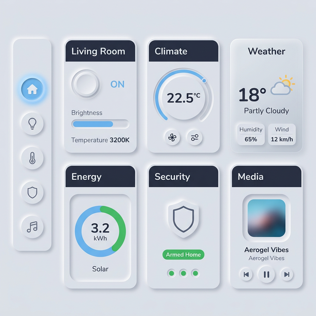

# Aerogel NeoSurface Pro

Premium soft-3D theme for Home Assistant.

Solid readable surfaces. Neumorphic depth. Smart-home state colors.

[](https://www.home-assistant.io/)
[](https://hacs.xyz/)
[](LICENSE)



## Three Themes

- **Aerogel Pearl**: warm premium light mode with dense readable surfaces and soft white depth
- **Aerogel Graphite**: flagship showcase mode for premium dashboards and smart-home panels
- **Aerogel Obsidian**: near-black AMOLED mode for night use and wall panels

## Design Direction

Aerogel NeoSurface Pro is not a glassmorphism theme.

The system is intentionally weighted like this:

- `80%` solid surfaces
- `15%` soft 3D / NeoSurface depth
- `5%` decorative glass for header, sidebar, badges, and ambient layers

That means:

- no transparent text cards
- no blurry more-info bodies
- no washed-out dialogs
- no random glow as the main styling language

## What Changed

- Rebuilt the theme around **solid readable surfaces**
- Restored premium **3D neumorphic depth** using theme shadow tokens
- Restricted blur and translucency to **sidebar, header, badges, weather hero layers, and modal scrims**
- Split the visual system into **Pearl / Graphite / Obsidian**
- Reworked bundled cards to use shared surface, border, radius, and shadow tokens
- Added a Sections-based starter demo dashboard

## Theme File

The new primary theme file is:

- [themes/aerogel-pro.yaml](C:\Users\cashm\OneDrive\фото\Desktop\neumorphic-bliss\aerogel-theme\themes\aerogel-pro.yaml)

## Installation

### HACS

1. Add `https://github.com/skeep83/aerogel-theme` as a custom theme repository.
2. Install Aerogel NeoSurface Pro.
3. Reload themes in Home Assistant.
4. Pick `Aerogel Pearl`, `Aerogel Graphite`, or `Aerogel Obsidian`.

### Manual

1. Copy [themes/aerogel-pro.yaml](C:\Users\cashm\OneDrive\фото\Desktop\neumorphic-bliss\aerogel-theme\themes\aerogel-pro.yaml) into `/config/themes/`.
2. Make sure Home Assistant loads themes with:

```yaml
frontend:
  themes: !include_dir_merge_named themes
```

3. Reload themes and choose one of the three variants.

## Card-Mod Setup

Aerogel NeoSurface Pro relies heavily on `card-mod`.

Recommended Home Assistant configuration:

```yaml
frontend:
  themes: !include_dir_merge_named themes
  extra_module_url:
    - /hacsfiles/lovelace-card-mod/card-mod.js
```

Why:

- improves theme application outside Lovelace
- helps panel-wide styling
- is the recommended path for deeper `card-mod` integrations

## Bundled Cards

Bundled Lovelace cards live in [dist/aerogel-cards.js](C:\Users\cashm\OneDrive\фото\Desktop\neumorphic-bliss\aerogel-theme\dist\aerogel-cards.js).

- `aerogel-glass-card`
- `aerogel-neon-card`
- `aerogel-entity-card`
- `aerogel-gradient-card`
- `aerogel-weather-card`
- `aerogel-tile-card`
- `aerogel-room-card`
- `aerogel-climate-card`
- `aerogel-energy-card`

## Dashboard Demo

Starter Sections dashboard:

- [dashboards/aerogel-demo-sections.yaml](C:\Users\cashm\OneDrive\фото\Desktop\neumorphic-bliss\aerogel-theme\dashboards\aerogel-demo-sections.yaml)

Additional starter files remain available:

- [dashboards/aerogel-home.yaml](C:\Users\cashm\OneDrive\фото\Desktop\neumorphic-bliss\aerogel-theme\dashboards\aerogel-home.yaml)
- [dashboards/aerogel-climate.yaml](C:\Users\cashm\OneDrive\фото\Desktop\neumorphic-bliss\aerogel-theme\dashboards\aerogel-climate.yaml)
- [dashboards/aerogel-energy.yaml](C:\Users\cashm\OneDrive\фото\Desktop\neumorphic-bliss\aerogel-theme\dashboards\aerogel-energy.yaml)
- [dashboards/aerogel-wallpanel.yaml](C:\Users\cashm\OneDrive\фото\Desktop\neumorphic-bliss\aerogel-theme\dashboards\aerogel-wallpanel.yaml)

## Docs

- [docs/design-system.md](C:\Users\cashm\OneDrive\фото\Desktop\neumorphic-bliss\aerogel-theme\docs\design-system.md)
- [docs/color-tokens.md](C:\Users\cashm\OneDrive\фото\Desktop\neumorphic-bliss\aerogel-theme\docs\color-tokens.md)
- [docs/screenshots.md](C:\Users\cashm\OneDrive\фото\Desktop\neumorphic-bliss\aerogel-theme\docs\screenshots.md)
- [docs/migration-v5.md](C:\Users\cashm\OneDrive\фото\Desktop\neumorphic-bliss\aerogel-theme\docs\migration-v5.md)
